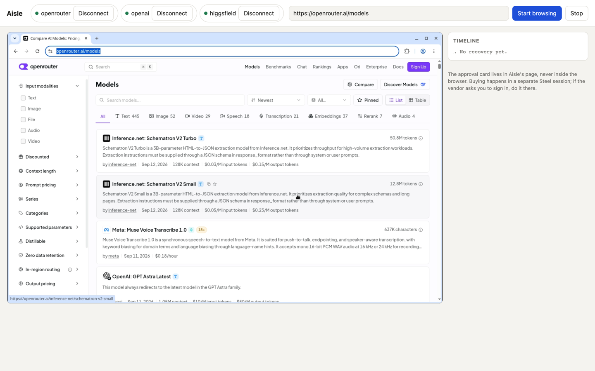
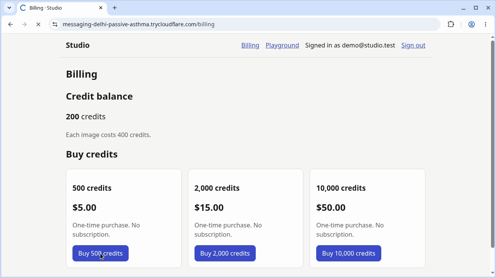
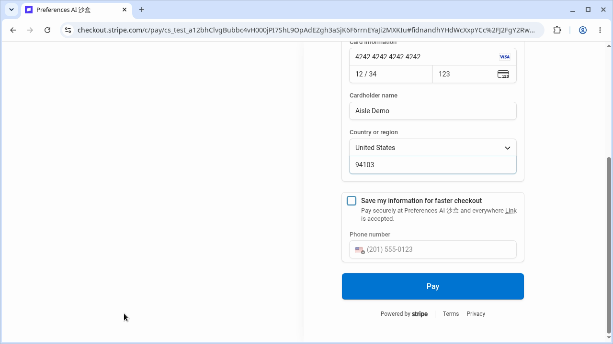
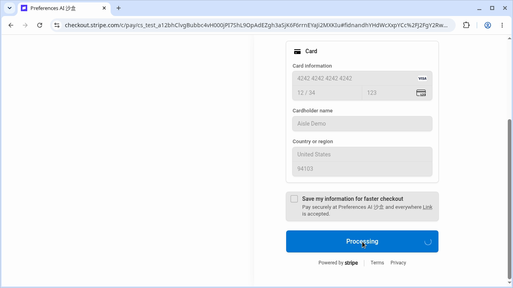
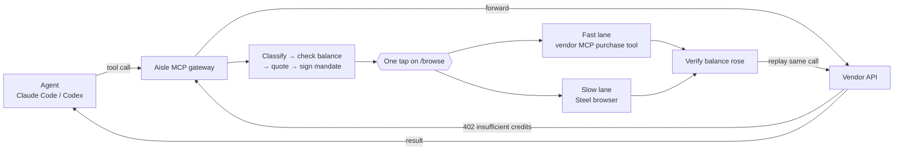

# Aisle

When an AI agent's tool call hits a paywall ("insufficient credits", HTTP 402), Aisle
pauses the call, works out the smallest one-time top-up that fixes it, asks you for
**one approval tap**, buys it (through the vendor's MCP purchase tools or in a
[Steel](https://steel.dev) cloud browser), checks that the balance actually went up,
and then replays the exact same call. The agent gets its answer as if nothing happened.



<table>
<tr>
<td width="33%"></td>
<td width="33%"></td>
<td width="33%"></td>
</tr>
<tr>
<td>1. Steel restores the vendor login and picks the pack</td>
<td>2. Checkout total is checked against the signed mandate</td>
<td>3. Code (never a model) clicks Pay; balance 200 → 700</td>
</tr>
</table>

<sub>Frames from a real run against the Studio demo vendor on Stripe test mode (card 4242, no real money).</sub>

## How it works



The rules that keep this safe:

- **Origins come from config** (`src/gateway/upstreams.json`), never from an error body, a page, or a model.
- **Ceilings:** $50 per purchase, $100 per task, $250 per day (`.env`). One-time packages only, never subscriptions or auto-renew.
- **A model never moves money.** Models may help find the buy button; the final Pay/Purchase click is deterministic code.
- **Gate 1** (before paying): the checkout total, currency and billing period must match the signed mandate.
- **Gate 2** (after paying): the vendor's balance must rise. A receipt is not proof.
- **Never retry after submit.** An unconfirmed purchase is `PURCHASE_UNKNOWN` and blocks a second one.
- **Aisle's own OpenRouter key** (`OPENROUTER_INFRA_KEY`) is infrastructure and is never topped up.

## Quick start

```bash
npm install
cp .env.example .env          # fill in STEEL_API_KEY, OPENROUTER_INFRA_KEY, vendor keys
npm run gateway:http          # MCP at :8788/mcp, /browse + approvals at :8787
```

Connect your agent:

```bash
claude mcp add --transport http aisle http://127.0.0.1:8788/mcp
codex mcp add aisle --url http://127.0.0.1:8788/mcp     # also set tool_timeout_sec = 300
```

Ports are `AISLE_MCP_PORT` / `AISLE_APPROVAL_PORT`; the agent's URL must match them.

Then ask the agent, for example:

- *"Use the openrouter chat tool to ask openai/gpt-4o-mini: what is 2+2?"*
- *"Use the aisle higgsfield__generate_image tool to make a picture of a red fox."*

If the vendor says you're out of credits, the tool returns an approval link within a few
seconds (`AISLE_INITIAL_BLOCK_MS`). Open `/browse`, pick a plan, tap **Approve**, and ask
the agent to call `aisle__wait_for_recovery` with the `recovery_id`.

## MCP tools

| Tool | What it does |
|---|---|
| `openrouter__chat` | OpenRouter chat completion with `OPENROUTER_DEMO_KEY` (a $0 account) |
| `openai__chat` | OpenAI chat completion with `OPENAI_API_KEY` |
| `higgsfield__generate_image` | Higgsfield image generation (only when `HIGGSFIELD_API_KEY_ID` + `_SECRET` are set) |
| `studio__generate_image` | Studio demo vendor (only while `npm run vendor:studio` is running) |
| `aisle__wait_for_recovery` | Wait for a recovery to finish; returns immediately while it still needs your tap |
| `aisle__spend_report` | Spend and recoveries for this session |

How the gateway reacts:

| Upstream answer | Aisle |
|---|---|
| 402 / `insufficient_credits` / OpenAI `insufficient_quota` | Recovery → tap → buy → verify → replay |
| 401 (blank or bad key) | Not a billing wall; passed through |
| 429 rate limit, `Retry-After < 60` | Retry once, never buy |

## Vendors

| Vendor | Buys on | Status |
|---|---|---|
| **Studio** (demo) | `/billing` → Stripe Checkout, test mode | End to end: JSON-LD offers, recorded adapter, test card, balance verified |
| **OpenRouter** | `openrouter.ai/settings/credits` | Real purchase verified ($0 → $5). Recorded path: Credits → Add Credits → amount → Purchase, saved card |
| **OpenAI** | `platform.openai.com` billing | Staged only: stops at Gate 1 (`STAGED_NOT_SUBMITTED`) |
| **Higgsfield** | `higgsfield.ai` avatar menu → top-up | Navigation built, but Higgsfield only offers top-ups to **paid subscribers**; on a Free Plan the run ends `RESOLUTION_EXHAUSTED`. API credits (cloud.higgsfield.ai) may also be a separate balance |

A vendor may be paid with real money only if it's listed in `AISLE_REAL_PURCHASE_PROVIDERS`
(e.g. `openrouter`). Everyone else stops after Gate 1. Aisle never types real card
details: the card must already be saved on the vendor account.

## Watching it: `/browse`

`http://127.0.0.1:8787/browse` is the one page you need:

- **Left:** the live Steel browser. During a recovery it switches to the purchase session so you watch the cursor buy.
- **Right:** the approval card (amount cap, product, billing, ceilings left, plan chooser, Approve/Reject) and the event timeline.
- **Takeovers:** if the vendor wants a sign-in or 3-D Secure, the viewer becomes interactive for up to 5 minutes, then Aisle continues.
- **Web path:** click **Connect** on a vendor chip, **Start browsing**, and use the site yourself. A 402 in the page freezes it, the card appears, and after the tap a separate Steel session buys using your live sign-in, then reloads your page.

Visual agents (Claude, ChatGPT) render the same view in chat as an MCP App widget
(`ui://aisle/recovery.html`). The widget never approves; the tap stays on Aisle's page.
Everything is logged to `.aisle/events.jsonl`, and each Steel session has a replay in the Steel dashboard.

## Buying in Steel: the click ladder

After approval, a vendor with a `purchase` block in `upstreams.json` runs the slow lane:

1. **Login.** Restore the vendor's Steel profile (or Steel's credentials vault). A login wall becomes a takeover.
2. **Balance.** Read it from the vendor API, or from the page. Already covered → nothing is bought.
3. **Tier 1:** offers from the page's JSON-LD, no clicking, no model.
4. **Tier 2:** replay recorded steps by accessible role and name.
5. **Tier 3:** the accessibility tree becomes a numbered list; the **picker** model returns one index; code clicks it. Steps that reach checkout are recorded for next time.
6. **Vision fallback:** if tier 3 stalls, a screenshot-driven computer-use agent gets a small step budget (never for the Pay click).
7. **Gate 1 → deterministic submit → Gate 2 → replay.**

| Model role | Default (all via OpenRouter, `OPENROUTER_INFRA_KEY`) | Override |
|---|---|---|
| Picker (text) | `qwen/qwen3.7-max` → `qwen/qwen3.7-plus` → `nvidia/nemotron-3-super-120b-a12b:free` | `OPENROUTER_PICKER_MODEL` |
| Vision fallback | `nvidia/nemotron-3-nano-omni-30b-a3b-reasoning:free` | `OPENROUTER_VISION_MODEL` |

Per-vendor knobs in `upstreams.json` handle awkward sites without code changes:
`offerEntryPath`, `offerRevealSelectors` (e.g. open an avatar menu), `excludeControlsPattern`
(hide "Upgrade" / "% OFF" bait), `dismissSelectors` (promo popups), `balanceSelectors`,
`balanceRevealSelector`, `accountPaths`, `loggedInSelector` / `loggedOutSelector`, `loginWallPattern`,
`paymentOrigins`, `steelCredentials`.

### Steel setup

```bash
npm run steel:credentials -- openrouter   # store email/password in Steel's vault (Aisle never sees them)
npm run steel:login -- higgsfield         # or sign a Steel profile in once by hand
npm run smoke:steel                       # create → CDP → navigate → release → profile READY
```

- **Profiles** are bound per `(user, vendor)` and restore cookies, storage and autofill. Profile IDs never appear in logs.
- **Stealth** (humanized input, real fingerprint) is on by default so vendors don't show "unsupported browser". It must match between login and purchase, so re-run `steel:login` if you toggle `AISLE_STEEL_STEALTH=0`.
- **Proxies and captcha solving** are off unless `AISLE_STEEL_PROXY_CAPTCHA=1` (needs a paid Steel balance).

## Demo end to end: Studio on Stripe test mode

`studio` (`src/demo-vendor/`) is a small real vendor that sells image credits through Stripe
Checkout in **test mode**, so the full flow runs with card 4242 4242 4242 4242 and no real money.

```bash
# .env: STRIPE_SECRET_KEY=sk_test_…   (live keys are refused)
npm run vendor:studio     # site + cloudflared tunnel; vaults the demo login in Steel
npm run gateway:http      # restart so it picks up .aisle/studio.json
```

Ask: *"Generate a hero image with the studio tool."* A real run from the log:

```
ENTITLEMENT_CHECKED   balance 200, required 400
QUOTE_CREATED         500 credits at $5 (smallest pack that clears the shortfall)
APPROVAL_GRANTED
ADAPTER_REPLAY        tier 2, "Buy 500 credits"
CHECKOUT_STAGED       $5 USD, one_time, autoRenew false
MANDATE_COMPARISON_PASSED  staged 5 ≤ cap 6.25
TEST_CARD_ENTERED     stripe 4242, testMode
CONFIRM_CLICKED       "Pay", deterministic
ENTITLEMENT_VERIFIED  before 200, after 700
SESSION_STATUS        READY_TO_RESUME
```

## Using it as a library

```ts
import {
  classifyFailure, freezeCheckpoint, lockOrigin, buildQuote, gate, loadLimits,
  signMandate, runFastLane, runSlowLane, NoFastLaneError,
} from "aisle";

const classified = classifyFailure(toolError, { provider: "openrouter" });
const checkpoint = freezeCheckpoint({
  taskId, toolCallId, tool, arguments: args,
  origin: lockOrigin("openrouter", upstreams.openrouter),   // never from the error body
  blocker: classified.blocker,
});
const q = buildQuote({ checkpoint, current, offers, perPurchaseCeiling: loadLimits().perPurchase });
if (q.kind !== "QUOTE") { /* ALREADY_COVERED → replay; NO_VIABLE_OFFER → refuse */ }
const verdict = gate(q.quote, checkpoint, spend);
const mandate = signMandate(q.quote, { taskId, recoveryJobId, userId });
// …user approves…
try {
  return await runFastLane({ checkpoint, quote: q.quote, mandate }, { session, store });
} catch (err) {
  if (!(err instanceof NoFastLaneError)) throw err;
  return await runSlowLane({ checkpoint, quote: q.quote, mandate }, { provider, adapter, store, profiles, agent });
}
```

Host integration, vendor MCP purchase tools, idempotency and error handling are in
[INTEGRATION.md](INTEGRATION.md). The recovery session state machine (`PLAN_RECOMMENDED →
AWAITING_APPROVAL → APPROVED → PURCHASING → PURCHASED → ENTITLEMENT_UPDATED → READY_TO_RESUME`)
is exported as `recoveryFlow`.

## Layout

```
src/
├── classifier.ts, interceptor.ts, wakeup-manager.ts   paywall detection → one recovery per requirement
├── core/  quote/  policy/  mandate/                   checkpoint, quote, ceilings + origin lock, signed mandate
├── fast-lane/  webmcp/                                buy through a vendor's MCP purchase tools
├── slow-lane/                                         Steel provider, click-ladder adapter, picker, computer use, profiles
├── recovery-flow/                                     plans, customer selection, recovery session state machine
├── gateway/                                           MCP gateway (stdio + HTTP), coordinator, approval page, Steel purchaser, upstreams.json
├── web/                                               /browse page, browsing session, CDP 402 detector, enrollments
└── demo-vendor/                                       Studio: Stripe test-mode vendor
docs/                                                  specs: aisle-pipeline.md, steel.md, web-path.md, SETUP.md
```

## Commands

```bash
npm test                 # vitest
npm run typecheck
npm run gateway:http     # HTTP MCP gateway + /browse
npm run gateway          # stdio MCP gateway
npm run steel:login -- <vendor>
npm run steel:credentials -- <vendor>
npm run vendor:studio
npm run smoke:steel
```

All environment variables are in [`.env.example`](.env.example). The specs in [`docs/`](docs/)
are the source of truth where they disagree with this README.

## Known gaps

- **Higgsfield** needs a paid subscription to show top-ups, and `HIGGSFIELD_CREDITS_URL` has no documented endpoint. Leave it blank so the balance is read from the site.
- **OpenAI** stays staged-only (`docs/SETUP.md` §4).
- **Recovery jobs live in memory.** No control plane, SSE stream or Postgres yet; the approval page polls.
- **No receipt upload or trace export** from Steel sessions.
- **Profile READY latency is unmeasured**; `waitForProfileReady` defaults to 60s.
