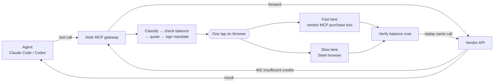

# Aisle

**Aisle is an agentic-checkout commerce agent.** You tell it what you want in plain language;
it finds *real* products, ranks and pitches them to your taste, gets **one approval**, and
completes a real merchant checkout, without ever seeing or typing your card. The same engine
also rescues an AI agent that hits a paywall mid-task: it buys the smallest top-up that clears
the wall and replays the call.

The repo is two layers that share one philosophy (find → price → one approval → buy → verify):

1. **Personalized Explore** — the consumer web app in [`web/`](web/): chat with Aisle to buy real
   Shopify products and SaaS tools. Live demo: **https://aisle-mauve.vercel.app**
2. **The purchase engine** — the MCP gateway in [`src/`](src/): signed mandates, balance gates,
   and a fast/slow purchase ladder that make autonomous buying safe. This is the "signed
   mandates, balance verification, 300+ tests" machinery behind the one-tap checkout.

---

## Personalized Explore (the web app)

A premium chat interface where you talk to the Aisle agent. It surfaces the full
agentic-checkout experience: personalized discovery, tone-tested pitches, one-tap approval,
checkout complements, receipts, order tracking, and SaaS tool discovery. Built with
Next.js (App Router) + Geist, and it ships with a demo agent so it deploys and demos on its own.

| Try this | You get |
|---|---|
| "Show me a blazer" / "Find me a keyboard" | A ranked, pitched shortlist, each card in a different tone |
| Click a product | The approval card: total, vaulted-card mandate, and "frequently bought together" |
| "Approve and buy" | A verified receipt (demo: nothing is really charged) |
| "Set up my profile" | Consent-gated persona capture (gender, budget, life stage, style, delivery address) that re-ranks results |
| "I need an MCP tool that sends email" | A SaaS recommendation with a buyable plan, plus complementary tools |
| "My For You" | Empty for a first-time user; fills after a purchase |
| Click "View order" on a receipt | An order-tracking page with a chat to cancel, reschedule, or change the delivery address |

What makes the shortlist yours:

- **Real products, invented only in tone.** Titles, prices, images and SKUs are pulled live
  from Shopify through **Agnic**; only the one-line pitch on each card is written by the LLM,
  and it is told not to claim specs the product name does not state.
- **Budget/persona-dominant ranking.** Your saved profile drives the order: gender-correct
  items first, then strictly cheapest-first (budget-conscious) or priciest-first
  (premium-seeker), with attribute overlap as the tiebreak. Tone and pitch copy follow the
  same stance, so a premium shopper never gets a "value" pitch and vice versa.
- **Complements for anything.** SaaS plans suggest paired tools; physical goods suggest real
  Agnic "frequently bought together" items.

### Run it

```bash
cd web
npm install
npm run dev            # http://localhost:3000
```

Demo mode needs no keys. To light up the real features, set these (in `web/.env.local`, or in
your Vercel project) — see [`web/README.md`](web/README.md) and [`web/.env.example`](web/.env.example):

| Variable | Enables |
|---|---|
| `AGNIC_TOKEN` | Real Shopify product browse (without it, browse says "connect Agnic") |
| `OPENROUTER_API_KEY` | Intelligent chat + the tone pitches (default model `deepseek/deepseek-chat-v3.1`, override with `AISLE_CHAT_MODEL`) |
| `NEXT_PUBLIC_SUPABASE_URL`, `NEXT_PUBLIC_SUPABASE_ANON_KEY` | Sign-in and cross-device profile sync |
| `NEXT_PUBLIC_SITE_URL` | Email-confirmation links that point at your real domain, not localhost |

Auth uses Supabase (cookie sessions via `@supabase/ssr`, with session-refresh middleware). Run
the SQL in [`supabase/migrations/`](supabase/migrations/) `001` → `005` in the Supabase SQL
editor; `005_profile_address.sql` adds the delivery-address column.

---

## The purchase engine (MCP gateway)

When an AI agent's tool call hits a paywall ("insufficient credits", HTTP 402), the gateway
pauses the call, works out the smallest one-time top-up that fixes it, asks for **one approval
tap**, buys it (through the vendor's MCP purchase tools or in a [Steel](https://steel.dev) cloud
browser), checks that the balance actually rose, and replays the exact same call. The agent gets
its answer as if nothing happened.



The rules that keep it safe:

- **Origins come from config** (`src/gateway/upstreams.json`), never from an error body, a page, or a model.
- **Ceilings:** $50 per purchase, $100 per task, $250 per day (`.env`). One-time packages only, never subscriptions or auto-renew.
- **A model never moves money.** Models may help find the buy button; the final Pay/Purchase click is deterministic code.
- **Gate 1** (before paying): the checkout total, currency and billing period must match the signed mandate.
- **Gate 2** (after paying): the vendor's balance must rise. A receipt is not proof.
- **Never retry after submit.** An unconfirmed purchase is `PURCHASE_UNKNOWN` and blocks a second one.

### Run the gateway

```bash
npm install
cp .env.example .env          # fill in STEEL_API_KEY, OPENROUTER_INFRA_KEY, vendor keys
npm run gateway:http          # MCP at :8788/mcp, /browse + approvals at :8787
```

```bash
claude mcp add --transport http aisle http://127.0.0.1:8788/mcp
codex mcp add aisle --url http://127.0.0.1:8788/mcp     # also set tool_timeout_sec = 300
```

`http://127.0.0.1:8787/browse` is the watch-and-approve page: a live Steel browser on the left,
the approval card and event timeline on the right. Everything is logged to `.aisle/events.jsonl`.

MCP tools: `openrouter__chat`, `openai__chat`, `higgsfield__generate_image`,
`studio__generate_image`, `aisle__wait_for_recovery`, `aisle__spend_report`.

### Vendors and the click ladder

| Vendor | Buys on | Status |
|---|---|---|
| **Studio** (demo) | `/billing` → Stripe Checkout, test mode | End to end with card 4242, balance verified |
| **OpenRouter** | `openrouter.ai/settings/credits` | Real purchase verified ($0 → $5) |
| **OpenAI** | `platform.openai.com` billing | Staged only: stops at Gate 1 |
| **Higgsfield** | `higgsfield.ai` top-up | Navigation built; top-ups need a paid subscription |

A vendor is paid with real money only if it is in `AISLE_REAL_PURCHASE_PROVIDERS`; everyone else
stops after Gate 1. Aisle never types real card details — the card must already be saved on the
vendor account. The slow lane climbs a ladder (page JSON-LD → recorded steps → an accessibility
picker model → a vision fallback, never for the Pay click); see [`docs/steel.md`](docs/steel.md).

### Demo end to end: Studio on Stripe test mode

```bash
# .env: STRIPE_SECRET_KEY=sk_test_…   (live keys are refused)
npm run vendor:studio     # site + cloudflared tunnel; vaults the demo login in Steel
npm run gateway:http      # restart so it picks up .aisle/studio.json
```

```
ENTITLEMENT_CHECKED   balance 200, required 400
QUOTE_CREATED         500 credits at $5 (smallest pack that clears the shortfall)
APPROVAL_GRANTED
CHECKOUT_STAGED       $5 USD, one_time, autoRenew false
MANDATE_COMPARISON_PASSED  staged 5 ≤ cap 6.25
TEST_CARD_ENTERED     stripe 4242, testMode
CONFIRM_CLICKED       "Pay", deterministic
ENTITLEMENT_VERIFIED  before 200, after 700
```

Using the engine as a library (`classifyFailure`, `signMandate`, `runFastLane`, `runSlowLane`, …)
and host integration are in [INTEGRATION.md](INTEGRATION.md).

---

## Layout

```
web/                                   Personalized Explore: Next.js chat app (the shopping agent)
├── app/                               routes: /, /profile, /order/[id], api/chat, api/order-chat, api/profile
├── components/                        Chat, ProfileEditor, AuthPanel, product/receipt blocks
└── lib/                               agent, pitch (ranking + tone), agnic, recommend, supabase
supabase/migrations/                   profiles schema + repairs (001 → 005)
src/                                   the purchase engine (MCP gateway)
├── classifier.ts, interceptor.ts      paywall detection → one recovery per requirement
├── core/ quote/ policy/ mandate/      checkpoint, quote, ceilings + origin lock, signed mandate
├── fast-lane/ slow-lane/              vendor MCP purchase tools; Steel click ladder, picker, profiles
├── recovery-flow/ gateway/            recovery state machine; MCP gateway, /browse, purchaser, upstreams.json
└── demo-vendor/                       Studio: Stripe test-mode vendor
docs/                                  specs: aisle-pipeline.md, steel.md, web-path.md, SETUP.md
```

## Commands

```bash
# web app
cd web && npm run dev          # or: npm run build

# purchase engine
npm test                       # vitest
npm run typecheck
npm run gateway:http           # HTTP MCP gateway + /browse
npm run gateway                # stdio MCP gateway
npm run vendor:studio          # Stripe test-mode demo vendor
npm run steel:login -- <vendor>
npm run smoke:steel
```

Web env is in [`web/.env.example`](web/.env.example); engine env is in [`.env.example`](.env.example).
The specs in [`docs/`](docs/) are the source of truth where they disagree with this README.

## Known gaps

- **Recovery jobs live in memory** in the gateway; no control plane or SSE stream yet (the approval page polls).
- **OpenAI** stays staged-only; **Higgsfield** needs a paid subscription to show top-ups.
- In the web app, **browse and sign-in need `AGNIC_TOKEN` and Supabase keys**; without them the app runs in demo mode.
- No receipt upload or trace export from Steel sessions.
